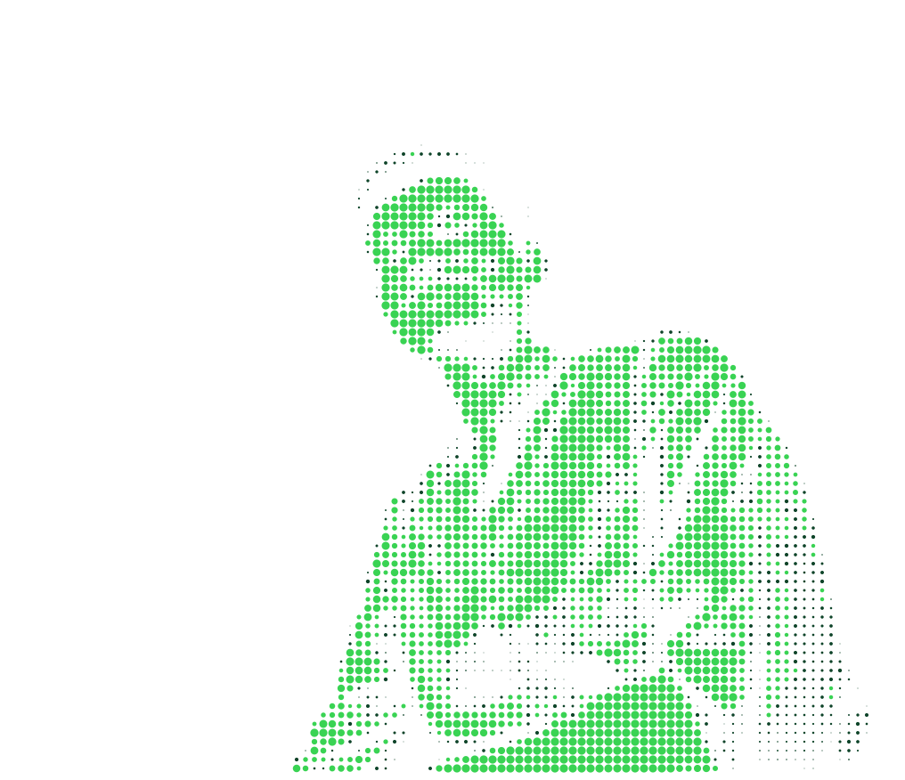
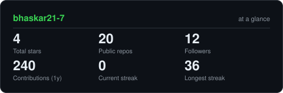
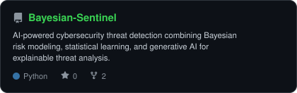
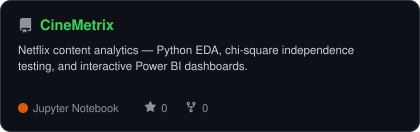
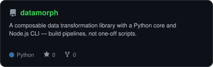
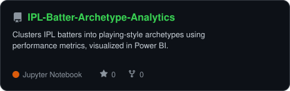

<div align="center">

<!-- PORTRAIT - generated by scripts/dotify.py from me.png
     Green monochrome mode, dark/light pair. Regenerate with:
       python scripts/dotify.py me.png -o assets/portrait \
         --cols 100 --equalize --detail 0.5 --animate -->
<picture>
  <source media="(prefers-color-scheme: dark)"  srcset="assets/portrait-dark.svg">
  <source media="(prefers-color-scheme: light)" srcset="assets/portrait-light.svg">
  
</picture>

<br>

<!-- NAME / TAGLINE - animated typing -->
<a href="https://github.com/bhaskar21-7">
  
</a>

<br>

<!-- SOCIALS -->
<a href="https://linkedin.com/in/bhaskar-jha-50838431a"></a>
<a href="mailto:bhaskar13170@gmail.com"></a>


</div>

---

## `~/` whoami

```console
$ cat about.txt
```

Hi, I'm **Bhaskar**. B.Sc. Statistics student at MSU Baroda, currently prepping for
**IIT JAM Mathematical Statistics 2027**. I build data projects at the intersection of
statistics, ML, and whatever problem is in front of me — cricket analytics and quant
finance are the threads that keep coming back.

- Currently prepping for **IIT JAM Mathematical Statistics 2027**
- On the Academic Team of my department's **Departmental Statistical Association (DSA)**
- GSoC 2025 alum
- Fun fact: **cricket analytics and quant finance are where most of my side projects end up**

<br>

<div align="center">

## `~/` toolbox


</div>

---

<div align="center">

## `~/` skill radar

<table>
<tr>
<td width="50%" align="center" valign="middle">

<!-- Self-rated radar - edit assets/skills.json, the workflow redraws it -->
<picture>
  <source media="(prefers-color-scheme: dark)"  srcset="assets/radar-dark.svg">
  <source media="(prefers-color-scheme: light)" srcset="assets/radar-light.svg">
  
</picture>

</td>
<td width="50%" align="center" valign="middle">

<!-- Live radar built from real language byte counts across your repos -->
<picture>
  <source media="(prefers-color-scheme: dark)"  srcset="assets/radar-langs-dark.svg">
  <source media="(prefers-color-scheme: light)" srcset="assets/radar-langs-light.svg">
  
</picture>

</td>
</tr>
</table>

</div>

---

<div align="center">

## `~/` contribution calendar

<!-- 3D isometric calendar, regenerated every 6h by .github/workflows/metrics.yml -->


<br><br>

<!-- Snake eats the contribution graph - .github/workflows/snake.yml -->
<picture>
  <source media="(prefers-color-scheme: dark)"  srcset="https://raw.githubusercontent.com/bhaskar21-7/bhaskar21-7/output/snake-dark.svg">
  <source media="(prefers-color-scheme: light)" srcset="https://raw.githubusercontent.com/bhaskar21-7/bhaskar21-7/output/snake.svg">
  
</picture>

</div>

---

<div align="center">

## `~/` the numbers

<!-- Generated by scripts/cards.py into this repo. -->
<picture>
  <source media="(prefers-color-scheme: dark)"  srcset="assets/card-stats-dark.svg">
  <source media="(prefers-color-scheme: light)" srcset="assets/card-stats-light.svg">
  
</picture>

<br>


<br><br>


</div>

---

<div align="center">

## `~/` selected work

<!-- Cards generated by scripts/cards.py from assets/projects.json. -->
<table>
<tr>
<td width="50%">
  <a href="https://github.com/bhaskar21-7/Bayesian-Sentinel">
    <picture>
      <source media="(prefers-color-scheme: dark)"  srcset="assets/card-Bayesian-Sentinel-dark.svg">
      <source media="(prefers-color-scheme: light)" srcset="assets/card-Bayesian-Sentinel-light.svg">
      
    </picture>
  </a>
</td>
<td width="50%">
  <a href="https://github.com/bhaskar21-7/CineMetrix">
    <picture>
      <source media="(prefers-color-scheme: dark)"  srcset="assets/card-CineMetrix-dark.svg">
      <source media="(prefers-color-scheme: light)" srcset="assets/card-CineMetrix-light.svg">
      
    </picture>
  </a>
</td>
</tr>
<tr>
<td width="50%">
  <a href="https://github.com/bhaskar21-7/datamorph">
    <picture>
      <source media="(prefers-color-scheme: dark)"  srcset="assets/card-datamorph-dark.svg">
      <source media="(prefers-color-scheme: light)" srcset="assets/card-datamorph-light.svg">
      
    </picture>
  </a>
</td>
<td width="50%">
  <a href="https://github.com/bhaskar21-7/IPL-Batter-Archetype-Analytics">
    <picture>
      <source media="(prefers-color-scheme: dark)"  srcset="assets/card-IPL-Batter-Archetype-Analytics-dark.svg">
      <source media="(prefers-color-scheme: light)" srcset="assets/card-IPL-Batter-Archetype-Analytics-light.svg">
      
    </picture>
  </a>
</td>
</tr>
</table>

<sub>

| project | stack |
|---|---|
| **[Bayesian-Sentinel](https://github.com/bhaskar21-7/Bayesian-Sentinel)** | `Python` `Bayesian Modeling` `Generative AI` |
| **[CineMetrix](https://github.com/bhaskar21-7/CineMetrix)** | `Python` `Power BI` `Statistics` |
| **[datamorph](https://github.com/bhaskar21-7/datamorph)** | `Python` `Node.js CLI` |
| **[IPL-Batter-Archetype-Analytics](https://github.com/bhaskar21-7/IPL-Batter-Archetype-Analytics)** | `Python` `Power BI` |

</sub>

</div>

---

<div align="center">

<sub>`01110011+01110100+01100001+01110100+01110011`</sub>

</div>